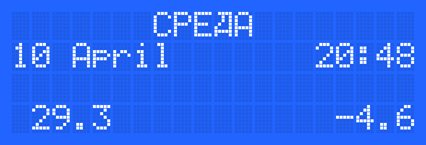

Электронный календарь на STM8S003F3P6TR  
Компилятор: <b>SDCC</b> 
Для сборки проекта: <b>make all -j4</b> 
Для загрузки: <b>make flash 
[Схема устройства](kicad/scheme.pdf) 

Скриншоты дисплея: 

Фото устройства:

